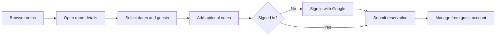

# Grand Arcadia

A luxury hotel booking application built with Next.js, Supabase, and Auth.js. Guests can browse rooms, check availability, make reservations, and manage their stays through a private guest account.


---

## Table of Contents

- [Features](#features)
- [Tech Stack](#tech-stack)
- [Booking Flow](#booking-flow)
- [Authentication](#authentication)
- [Data](#data)
- [Project Structure](#project-structure)
- [Getting Started](#getting-started)
- [Deployment](#deployment)
- [Technical Notes](#technical-notes)
- [Current Status](#current-status)
- [Roadmap](#roadmap)
- [Author](#author)
- [License](#license)

---

## Features

**Room discovery**

- Browse rooms and filter by guest capacity
- View room details, pricing, and availability
- Select dates with unavailable dates disabled

**Reservations**

- Create reservations with guest count and stay notes
- Sign in with Google
- Edit or delete eligible reservations

**Guest account**

- Personalized dashboard showing your next upcoming stay
- View upcoming and past reservations
- Manage guest profile information

**Design**

- Responsive layouts for rooms and account pages
- Dark slate and gold visual theme

---

## Tech Stack

| Technology                                                                                           | Purpose                             |
| ---------------------------------------------------------------------------------------------------- | ----------------------------------- |
|             | Application framework and routing   |
|                    | UI and interactive components       |
|  | Styling                             |
|               | PostgreSQL database and data access |
|                   | Google authentication and sessions  |
|  | Reservation date selection          |
|              | Date calculations and formatting    |
|            | UI icons                            |
|                                                 | Toast notifications                 |

---

## Booking Flow



> [!NOTE]
> Reservations are currently created with an `unconfirmed` status. Online payment is not part of the current implementation.

---

## Authentication

Authentication uses Auth.js / NextAuth.js with Google as the configured provider.

1. When a user signs in, the app looks up the matching guest record, creating one if necessary.
2. The guest ID is attached to the session.
3. That ID is used to access account-specific data.

Account routes are protected, and reservations are always associated with the authenticated guest.

---

## Data

Grand Arcadia uses Supabase for application data.

| Table      | Purpose                                                   |
| ---------- | --------------------------------------------------------- |
| `cabins`   | Room details, capacity, pricing, images, and descriptions |
| `guests`   | Guest identity and profile information                    |
| `bookings` | Reservations, dates, guest count, pricing, and status     |
| `settings` | Booking-length rules used by the availability calendar    |

The Supabase client and database operations live in the application's data-service layer rather than being spread throughout the UI.

---

## Project Structure

```text
src/
├── app/
│   ├── _components/       # Shared UI components
│   ├── _lib/              # Auth, Supabase, data services, and actions
│   ├── _styles/           # Global styles and Tailwind theme
│   ├── about/             # About page
│   ├── account/           # Guest dashboard, profile, and reservations
│   ├── api/               # API routes
│   ├── rooms/             # Room listing and booking pages
│   ├── error.js           # Error boundary
│   ├── loading.js         # Loading UI
│   ├── layout.js          # Root layout
│   └── page.js            # Home page
├── proxy.js               # Account route protection
└── ...

public/                    # Brand assets and static images
```

---

## Getting Started

### Requirements

- Node.js
- npm
- A Supabase project configured with the required tables
- Google OAuth credentials

### Installation

```bash
git clone https://github.com/RohanChimbaikar/the-grand-arcadia-client-app.git
cd the-grand-arcadia-client-app
npm install
```

### Environment Variables

Create a `.env.local` file in the project root:

```env
SUPABASE_URL=
SUPABASE_KEY=
AUTH_GOOGLE_ID=
AUTH_GOOGLE_SECRET=
```

Add the values from your Supabase project and Google OAuth configuration.

> [!WARNING]
> Keep `.env.local` private and never commit credentials to the repository.

### Start the Development Server

```bash
npm run dev
```

The application will be available at `http://localhost:3000`.

<details>
<summary>Other available scripts</summary>

```bash
npm run build    # Create a production build
npm run start    # Run the production build
npm run lint     # Lint the codebase
```

</details>

---

## Deployment

Grand Arcadia can be deployed to Vercel.

1. Add the same environment variables used locally to your Vercel project.
2. Make sure the Google OAuth callback configuration includes your deployed application URL.

---

## Technical Notes

<details>
<summary>Implementation highlights</summary>

- **Server Components** are used for pages that can fetch their data on the server.
- **Server Actions** handle reservation and profile mutations.
- **Supabase access** is centralized in the data-service layer.
- **Room availability** is calculated from existing bookings and the configured booking-length limits.
- **Account routes** are protected through the application's Auth.js setup.
- **Affected pages are revalidated** after reservation and profile changes.
- **The account home** derives upcoming stays and reservation counts from the signed-in guest's booking data.
- **Loading and error states** are included for the main application flows.

</details>

---

## Current Status

Grand Arcadia is a portfolio project with the main room discovery, authentication, reservation, and guest account flows implemented.

> [!IMPORTANT]
> Before treating this as a production booking platform, the server-side authorization and validation around reservation updates should be strengthened. Online payments, automated tests, and database migrations are also not currently included.

---

## Roadmap

- [ ] Add online payment processing
- [ ] Send reservation confirmation and reminder emails
- [ ] Strengthen server-side authorization and validation
- [ ] Add automated tests
- [ ] Add database migrations

---

## Author

**Rohan Chimbaikar**

[](https://github.com/RohanChimbaikar)

---
